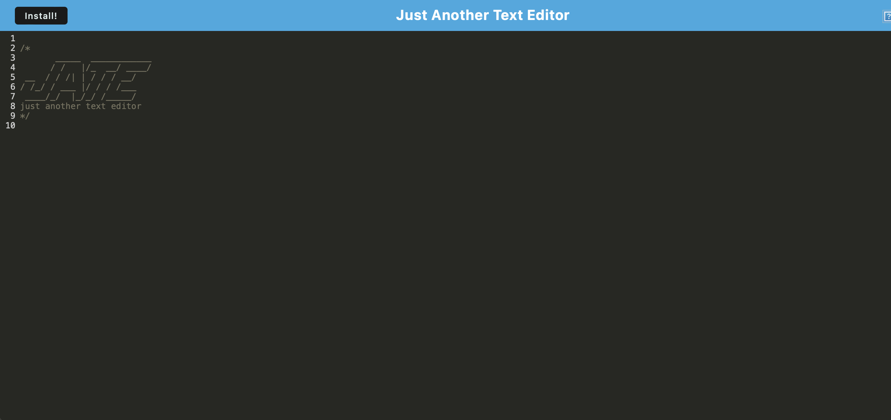

# Remote-Pwas-
PWA

Total overview in this week the frist weak of using PWA Progressive Web Applications I have created a text file editor and saver using PWA Functinality fixing the ammount broken code from previous project week as well as implimenting the required fixing functions of the source code given by the ucla assigment code freebase.  
what are PWAS and So. 
PWA stands for Progressive Web App, which is a type of web application that uses modern web technologies to provide an app-like experience to users. PWAs are designed to work on any device or browser, and they can be accessed directly from the web without requiring installation from an app store.

PWAs use a combination of technologies such as responsive design, service workers, and caching to provide features such as offline access, push notifications, and smooth performance. They can also be added to a user's home screen, just like a native app.

One of the main benefits of PWAs is that they provide a more seamless experience for users since they don't require a separate installation or update process. They are also more cost-effective for developers since they don't require development for multiple platforms.

Overall, PWAs offer a great solution for businesses or developers looking to provide a fast and engaging user experience for their web applications.